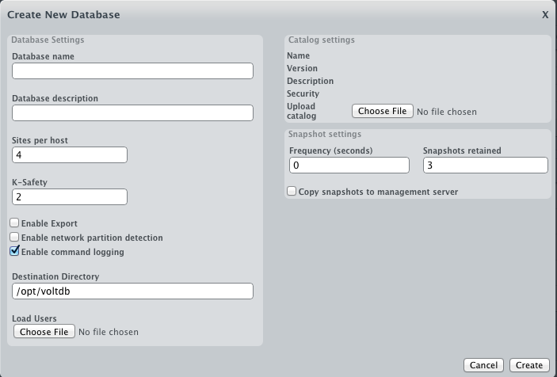
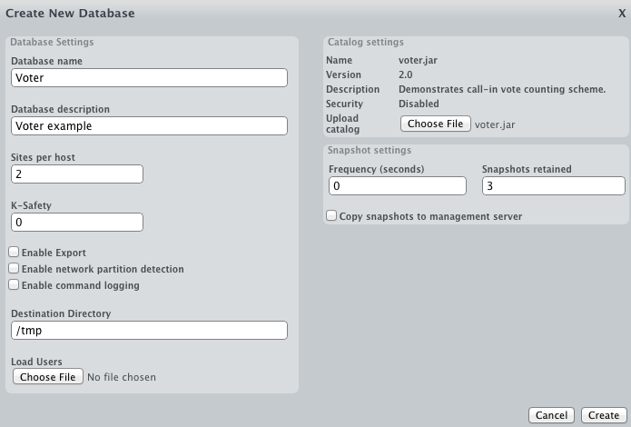

# VoltDB Administrator Training #

This is a draft of training materials for [VoltDB](http://www.voltdb.com) Administrators.

**[Ben Ballard](mailto://bballard@voltdb.com)**  

## About #

This is technical training focused on the administration of VoltDB clusters.  It is meant to serve as curriculum for instructor-led training or to be used as standalone self-paced instruction material.  As a Github Gist, this material is version controlled and allows comments and easy downloads.  Other people can fork it and make new versions of it.  It can be also used as a quick reference for Administrators.

I reference VoltDB online documentation when possible, rather than repeating it.

# Overview #

### What is VoltDB? ###
VoltDB is an ACID-compliant SQL RDBMS that is specialized for High Velocity scaling in BigData environments.  It runs on 64-bit Linux and is optimized for today's hardware.  Some of the most important attributes and features are:

- Fast & Scalable
    - In-memory operation
    - Streamlined transaction processing / concurrency management
    - Automatic partitioning / sharding
    - Scale-out on commodity servers
- Reliable
    - Built-in fault tolerance & high availability
    - Built-in durability to disk
    - Database replication

### How does VoltDB Work? ###
For an introduction to the architecture of VoltDB and how it processes transactions at such a high velocity, read [*Using VoltDB*: section 1.3](http://community.voltdb.com/docs/UsingVoltDB/IntroHowVoltDBWorks).  Some important concepts are:

- All data is stored in main memory, so the database cluster must have sufficient memory to store the entire database.
- Persistence to disk is for recovery only.
- Tables are partitioned on a key column, and distributed across "execution engines", essentially across the CPU cores in the cluster.
- Client applications use a library to connect to the database over TCP and call stored procedures.
- Stored procedures are routed to the correct execution engine and executed in the order they were received.
- The database can be configured so that execution engines on separate servers do the same work and store identical data, for synchronous replication.  This enables high availability by allowing the database cluster to survive the failure of one or more servers.

Then, read [*Getting Started*: Chapter 1](http://community.voltdb.com/docs/GettingStarted/IntroChap#HowVoltDBWorks) for an overview of how the schema and stored procedures that make up a VoltDB application are put together.  Some of the important concepts are:

- A VoltDB database cluster runs a single instance or schema
- The schema:
    - contains DDL (table, view and index definitions) in one or more .sql text files.
    - contains stored procedures defined in DDL or as simple java classes.
    - is pre-compiled into a .jar  "catalog" file.
    - does not contain data.

### VoltDB Editions ###

VoltDB Enterprise Edition shares virtually all of the same code as VoltDB Community Edition, but adds additional features.

<table>
  <tr>
      <th>Feature</th>
      <th>Community Edition</th>
      <th>Enterprise Edition</th>
  </tr>
  <tr>
      <td>High Performance</td>
      <td>X</td>
      <td>X</td>
  </tr>
  <tr>
      <td>Multi-node clusters</td>
      <td>X</td>
      <td>X</td>
  </tr>
  <tr>
      <td>High Availability</td>
      <td>X</td>
      <td>X</td>
  </tr>
  <tr>
      <td>Fast Export to CSV</td>
      <td>X</td>
      <td>X</td>
  </tr>
  <tr>
      <td>Command Log</td>
      <td></td>
      <td>X</td>
  </tr>
  <tr>
      <td>VoltDB Enterprise Manager</td>
      <td></td>
      <td>X</td>
  </tr>
  <tr>
      <td>VoltDB Database Replication</td>
      <td></td>
      <td>X</td>
  </tr>
  <tr>
      <td>Live Rejoin</td>
      <td></td>
      <td>X</td>
  </tr>
  <tr>
      <td>Fast Export to Hadoop</td>
      <td></td>
      <td>X</td>
  </tr>
</table>

**VoltDB Enterprise Manager** provides a full graphical web-based interface for administering VoltDB clusters.  It makes it easy to configure and start a cluster, and eliminates the need for manual configuration of xml files, scripting, and pre-installation of VoltDB to all machines in a cluster.

Both editions of VoltDB can be administered from the command line interface.  There are no actions or tasks that can be performed in VoltDB Enterprise Manager that cannot be done alternatively from the command line.  

You can choose the interface that is most comfortable for you to use, or that offers the level of control, ease of use, or customization that you most prefer.  However, VoltDB Enterprise Manager is not currently able to connect to or control a cluster that was started from the command line, so whichever interface you choose should be used consistently.  The exercises later in this tutorial are in two separate tracks, for command line interface and VoltDB Enterprise Manager.

# Installation #

VoltDB runs on servers that meet the following [OS and Software Requirements](http://community.voltdb.com/docs/UsingVoltDB/ChapGetStarted):

- Operating System:
    - 64-bit Linux:
        - CentOS 5.6 or later (binary compatible with RHEL 5.6 or later)
        - Ubuntu 10.4 or later
    - Mac OS X 10.6 (Snow Leopard) or later
- JDK 6_20 or later
- NTP (only for versions before VoltDB 3.0)

Download [Enterprise Edition] (http://voltdb.com/products-services/downloads)

Download [Community Edition] (http://community.voltdb.com/downloads)

The following sections provide a quick summary of the installation process.  Read more detail about the installation process in [*Using VoltDB:* 2.2 - Installing VoltDB](http://community.voltdb.com/docs/UsingVoltDB/installDist).

### Installing to the home directory ###
The simplest and most typical way to install VoltDB is install it under the HOME directory of your user account.  This is easy for development and gives you full access to the software without requiring root permission.  This can be done easily with the following command:

    tar -xzvf voltdb-ent-2.8.4.tar.gz -C $HOME
    
### Installing to a standard directory ###
For production use, VoltDB is often installed into a standard folder for software such as /opt/voltdb.

    sudo tar -xzvf voltdb-ent-2.8.4.tar.gz -C /opt
    cd /opt
    sudo mv voltdb-ent-2.8.4 voltdb

### Installing using the Debian package ###
VoltDB Community Edition is also available as a [Debian package] (http://community.voltdb.com/downloads), so for Debian-based systems such as Ubuntu it can be installed using the dpkg command:

    sudo dpkg -i voltdb_2.8.4_amd64.deb

## Post-installation Setup ##

Except when using the Debian package, VoltDB is entirely installed into a single directory, so it's easy to review what is included.  The contents are organized by the following folders:

<table>
    <tr>
        <td>voltdb/</td>
        <td>VoltDB Software jar files and runtimes</td>
    </tr>
    <tr>
        <td>examples/</td>
        <td>Example applications you can run (voter, voltcache, voltkv)</td>
    </tr>
    <tr>
        <td>bin/</td>
        <td>Shell commands: voltcompiler, voltdb, sqlcmd, exporttofile</td>
    </tr>
    <tr>
        <td>doc/</td>
        <td>Product manuals (PDF), javadoc, and tutorials</td>
    </tr>
</table>

Read [*Using VoltDB* section 2.4 - What is Included in the VoltDB Distribution](http://community.voltdb.com/docs/UsingVoltDB/installComponents) for more details.

To make it easier to use and maintain scripts, you may want to do some of the following:

- Install VoltDB into a directory with a fixed name, such as $HOME/voltdb or /opt/voltdb, so that regardless of the version installed, the directory is the same.
- Set this path to an environment variable, e.g. VOLTDB_HOME.
- Add the $VOLTDB_HOME/bin directory to the PATH environment variable.

Normally you install VoltDB by downloading the voltdb-*.tar.gz file and extracting it to the home directory of the user account that will be used to run the database.  Then to run the command-line tools more easily, add the /bin directory to the PATH environment variable.

Another method of installation for Ubuntu or Debian-based Linux distributions is to use the .deb debian package file.  This will install VoltDB directly into the application and library directories that are shared by all users.  Because of this, the executables will automatically be in the PATH environment variable.  

# An Introduction to the VoltDB interfaces #
## Command line with the aid of scripts ##
### Start the database ###
Open a terminal window and run the following commands:

    cd ~/voltdb-2.8.4
    cd examples/voter

Compile the catalog

    ./run.sh catalog
    
Start the database
    
    ./run.sh server

You're should see VoltDB starting up in that window.  The last output line should read "Server completed initialization."  The database is running, but no data has been loaded.  

### Run the Client to load data ###
This database application comes with a high performance benchmark client application that loads data and records statistics of how fast the data is loaded.  It also includes a web interface that shows real-time analytics results.

To view the web interface, launch a web browser and open the file "voltdb-*/examples/voter/LiveStats.html".

To run the client, open a new terminal window and run the following commands:

    cd ~/voltdb-*
    cd examples/voter
    ./run.sh client

You should see the output of the client as it connects to the VoltDB database running on the localhost, and runs the simulation that loads data.  By default it is set to run for 60 seconds.  While the client is running, you should see the real-time results updating on the web page.

Once the client finishes, leave the first terminal window that is running the database open.  We'll be connecting to this database with the SQLCMD and VoltDB Studio tools.

## SQLCMD ##
SQLCMD is VoltDB's command-line SQL interface tool.  
Open a new terminal window and type the following commands:

    cd ~/voltdb-*
    cd bin
    sqlcmd
    
You should get a SQL prompt. Try running a query:

    select * from contestants;
    exec Results;

You should get the results formatted as text.

Aside from SQL, you can also call stored procedures and System procedures using the "exec" command.  Try the following commands:

    exec @SystemInformation OVERVIEW;
    exec @SystemInformation DEPLOYMENT;
    
System procedures are built-in procedures that provide information about the configuration and operating conditions of a VoltDB cluster.  [Appendix G](http://community.voltdb.com/docs/UsingVoltDB/AppSysProc) of Using VoltDB provides a reference for all of the available System procedures.

You can exit the SQLCMD interface using the exit command:

    exit

Another way of using SQLCMD is in a script.  SQLCMD can execute commands passed in from STDIN non-interactively.  Exit SQLCMD and try the following example:

    exit
    echo "exec Results;" | sqlcmd

## VoltDB Studio ##
Open a web browser and type in the following URL:

[http://localhost:8080/studio](http://localhost:8080/studio)
    
This should bring up the VoltDB Studio web interface and connect it to the database running on the localhost.

On the left side of the screen, you can browse the database schema.

On the right side, you should see a query window labeled "SQLQuery1.sql".  Type the following query in the window, and then click on the red exclamation point button on the toolbar to execute the query.

    select * from contestants;

    
You should see the results of the query.  You can also open new SQL query windows using the "New Query" toolbar button.  Try that, and this time run the following stored procedure call:

    exec Results;
    
Another tool in VoltDB Studio is the Performance Monitor.  Click on the "Open Performance Monitor" toolbar button.  You should see a new tab on the page with running charts that show Latency and Transactions/s.  These are real-time statistics you can monitor to see the current activity in the database.  Thereare pull-down selectors you can use to change each graph to show Memory in GB, or Partition Starvation (a visualization of the distribution of work within the database).

Below the charts on the Performance Monitor is a summary statistics table that shows the number of calls to each of the stored procedures that has been invoked in the database, and the min, avg and max execution times in milliseconds.  

Re-run the client (./run.sh client) in the terminal window and observe real-time measurements in the Performance Monitor.

## Manually starting the database ##
When we started the "voter" database earlier, we took some shortcuts by using the provided run.sh script.  This handled all of the command-line parameters and settings, and used an existing set of configurations.  We're going to stop and restart the database, but this time using manual commands.

Go to the terminal window where you ran the "./run.sh server" command, where VoltDB is still running.  Type Ctrl-C to stop the database process, then type the following command to start the database manually:

    VOLTDB_HOME=`cd ~/voltdb-* && pwd`
    PATH=$PATH:$VOLTDB_HOME\bin
    voltdb start catalog voter.jar deployment deployment.xml \
        license $VOLTDB_HOME/voltdb/license.xml host localhost

The voltdb command uses the following structure:

    voltdb [create|recover|start] catalog [catalog file] deployment [deployment file] \
        license [license file] host [hostname of leader]

- action
    - create: Start the database with empty tables
    - recover: Start the database and recover (load) the data that was persisted when the dataabase was last running.
    - start: If data was persisted, perform the "recover" action, otherwise perform the "create" action.
- catalog: The pre-compiled .jar file that contains the schema and stored procedures for the database.
- deployment: A configuration file that contains settings that enable or disable various database features and configure parameters for them such as paths and ports to be used.
- license: a valid license .xml file
- host: the hostname of one server in the cluster that will act as the leader (only for the purpose of startup).
    
For more about starting VoltDB from the command line, read [*Using VoltDB* Chapter 6 - Running Your VoltDB Application](http://community.voltdb.com/docs/UsingVoltDB/ChapAppRun).

## Configuration Changes in Deployment.xml file ##

Most of the configuration settings for VoltDB are in the deployment.xml file.  Some of the more common settings are:

- How many servers are in the cluster
- How many execution engines should run on each server
- What level of replication should be used (if any) for high availability
- enable and configure the command log or automatic snapshots for durability
- enable the HTTP server that supports VoltDB Studio and the JSON interface.

Let's try a simple configuration change to reduce the number of execution engines that run on each server to just one.  In the voltdb-*/examples/voter directory, open the deployment.xml file with a text editor.  Change the "sitesperhost" setting to 1:

    <?xml version="1.0"?>
    <deployment>
        <cluster hostcount="1" sitesperhost="1" kfactor="0" />
    ...
    </deployment>

Now restart the database and run the client again.  With only one execution engine running, you will notice a difference in the throughput.

Additional settings will be covered below as we go through some of these features.  This was a very simple change that you can make even on a single-server deployment.  The reference for all of the available configuration settings in the deployment.xml file is [*Using VoltDB* Appendix F](http://community.voltdb.com/docs/UsingVoltDB/AppxConfigFile).

## VoltDB Enterprise Manager ##
VoltDB Enterprise Manager is a web-based management interface for VoltDB administration.  Administrators can use it to configure VoltDB servers or clusters, deploy these to available servers remotely, monitor their performance, and perform a number of maintenance operations.  All of these actions can be performed directly through command-line interfaces, but Enterprise Manager makes them easy and convenient.

To start VoltDB Enterprise Manager for the first time, first stop the Voter database instance that was running in a terminal window.  Then enter the following commands.  If you don't have a $VOLTDB_HOME/management folder, then you installed VoltDB Community Edition.  You will need to download a 30-day trial of Enterprise Edition and install it in order to use VoltDB Enterprise Manager.

    cd $VOLTDB_HOME/management
    ./enterprise_manager.sh -b
    
    VoltDB enterprise manager started in background...
    
The "-b" parameter causes the Enterprise Manager to run in the background.  It can be stopped using the following command:

    ./stop_enterprise_manager.sh
    
For now, leave it running.  Open a browser and go to [http://localhost:9000](http://localhost:9000).  You will be prompted for a user name and passwrod.  Enter the following defaults:

    Username: admin
    Password: voltdb
    
You should then see the following:

We're going to create the Voter database that we previously started from the command line.  We'll start with a very simple configuration.  

- Enter the information from Figure 2 into the form.  
- Click the "Choose File" button and navigate to $VOLTDB_HOME/examples/voter and upload the voter.jar file.  
- Click Create.

You should see the Voter database, and that it is currently Offline.  There will be a warning that the number of hosts must be > 0.  This warning is shown because you have only defined the database, but not how it will be deployed.  You need to add a server.

In the "Servers" section, click the *Add* button, then click "Add new server" from the listing.  In the form that pops up, under "IP or Host name *" enter "localhost".  Then click "Create".  You should now see localhost listed in the "Servers" section, and the warning is no longer shown.

Now you can start the database by clicking the "Start Database" button.  This brings up the "Start Database" form.

- Select Action: "Create new database"
- Select Mode: "Start in normal mode"
- Click "Start"

While the database is starting, you can observe the commands that are being executed under the Logs section.  When 

Installing VoltDB Enterprise Manager is the same process as installing VoltDB.  It is simply included with the Enterprise Edition.  There is one pre-requisite SSH setup, in addition to the normal server prerequisites for VoltDB.  The server or computer where VoltDB Enterprise Manageer will be running needs to allow SSH connection to the other servers that will be used in VoltDB clusters without prompting for password.  More about that [here](http://community.voltdb.com/docs/MgtGuide/SetUpPrepNodes).
- launch VEM
- configure an example app database
- configure a cluster of 1 machine
- start database
- run client
- stop database
- stop VEM

# Security #
Read [*Using VoltDB* Chapter 8](http://community.voltdb.com/docs/UsingVoltDB/ChapSecurity)

# Operational Exercises #

## 1. Starting and Stopping ##
VEM: Read [*Management Guide*: Chapter 5. Starting and Stopping the Database](http://community.voltdb.com/docs/MgtGuide/StartStopChap)

CLI: 

## 2. Manual snapshot ##

## 3. Recovery ##

## 4. Live Catalog Update ##
VEM: Read [*Management Guide*: 7.2. Updating the Application Catalog](http://community.voltdb.com/docs/MgtGuide/UpdateCatalog#UpdateAddVersion)

CLI: Read [Performing a live catalog update using the command line](http://community.voltdb.com/node/1436)

## 5. High Availability ## 
### Configuration ###
High Availability in VoltDB (also called K-safety) is achieved by having every record of data stored and every transaction processed in two or more places.  This allows the database cluster to continue functioning with no loss of data if one or more servers fail.  Another advantage to this approach is that since the work is done in parallel, the throughput of the database is not affected when a server fails.

Read [*Using VoltDB* - Chapter 11. Availability](http://community.voltdb.com/docs/UsingVoltDB/ChapKSafety) for a detailed description of how this feature works in VoltDB and how to configure it.

High availability is a configurable option that set before starting VoltDB.  If you're starting the database from the command line interface or with scripts, you set this option by editing the deployment.xml file.  For example, the following deployment.xml file has enabled k-safety by setting the kfactor setting to 2.  This allows for any 2 servers in the cluster to fail without loss of availability.

    <?xml version="1.0"?>
    <deployment>
        <cluster hostcount="6" sitesperhost="4" kfactor="2"/>
    </deployment>

If you are using VoltDB Enterprise Manager, it's one of the [Database Configuration options](http://community.voltdb.com/docs/MgtGuide/HostConfigDBOpts).

### Node Failure and Rejoin ###

## 6. Database Replication ##

## Stopping the database for Maintenance ##
If you're starting the database from the command line interface, read [Performing a Maintenance Window using the command-line](http://community.voltdb.com/node/1426).

If you're using VoltDB Enterprise Manager, read [*Management Guide* 5.2. Stopping the Database](http://community.voltdb.com/docs/MgtGuide/StopStopCluster).
VEM
CLI

# Upgrading VoltDB #
See [Upgrade Notes](http://community.voltdb.com/docs/EnterpriseReleaseNotes/index#UpgradeNotes) from Enterprise Release Notes.

# Support Overview #
